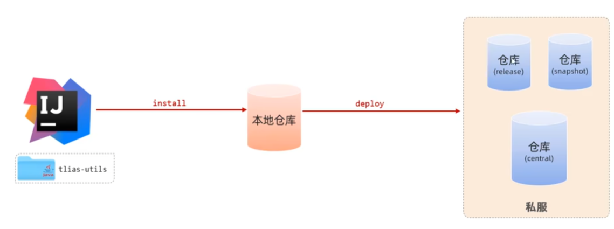

# 分模块设计与开发

将一个项目拆成多个模块进行开发

如果不分模块，所有的代码都写在一个项目当中，随着业务扩张，功能可能会越来越多，所有的代码在一个项目中，几十几百个人操作同一个项目，管理和维护会非常困难。想使用公共组件也很不方便，难以复用。

如电商平台项目，将大的项目拆分成若干个模块，将商品相关功能放在商品模块中，搜索相关功能放在搜索模块中，购物车模块，订单模块等等。也可以将通用类、工具类和通用组件单独放在一个模块中。只需要在业务模块中引入通用组件的坐标就可以了。


如之前的案例中，pojo包的实体类、utils包的工具类，其他项目组也想使用公共的组件，该怎么办？

能不能直接依赖tlias这个项目？肯定不行，这个项目包含了所有的业务代码，而想复用的资源仅仅是pojo和utils的类，导入整个项目不仅会影响性能，还会把所有代码对外公开，这是非常不安全的。

通过分模块设计就可以解决这个问题。创建一个模块`tlias-pojo`和`tlias-utils`仅仅存放pojo下的类和utils下的工具类，其他的代码不动。在原模块中需要将两个模块通过引入依赖引入进来

对模块进行拆分

**注意：分模块开发一定是先对模块进行设计，设计好了再进行编码实现，而不是先完成项目，完成之后再拆分。**

注意：创建模块时不需要基于Spring骨架创建了，**只需要创建一个正常的Maven模块**。

创建一个Maven模块，父类选择none，把pojo的所有类复制到新模块的`com.itheima.pojo`包中。

如下所示：


类上可能会有报错，在这个模块中导入Lombok就可以了

现在就可以删掉原模块中的pojo包，打开随便一个Controller发现会报错，将依赖引入后再看就不会报错了。

接下来拆分utils工具类，同样会报错，也是因为没有引入依赖，先引入JWT的依赖和阿里云OSS的依赖。最后还需要引入SpringBootweb开发的起步依赖，此时就不再报错了。再将utils模块引入到原模块中


验证一下，打开前端页面发个请求，可以正常执行。

# 继承与聚合

Maven中工程之间也可以有继承关系。刚才案例的三个模块中都引入了Lombok依赖，重复配置了多次，大型项目中重复的依赖可能会很多。如果每个模块中都配置一次，虽然能实现功能，但是配置是比较繁琐的。Maven的继承可以解决这个问题。

要使用Maven继承，需要建立一个父工程`tlias-parent`，让`pojo utils web-management`都来继承这个父工程，此时各个子工程中共有的依赖就可以定义在父工程当中，比如Lombok的依赖。

这样就简化依赖配置、统一管理依赖。

需要在各个子工程中的`<parent>`标签来指定父工程是谁。SpringBoot的项目都继承了一个父工程。

**注：创建父工程时要设置打包方式为pom（默认打包方式为jar）。**

常见打包方式

- jar：普通模块打包，SpringBoot项目基本都是jar包（因为有内嵌Tomcat服务器来运行项目）
- war：普通web程序打包，需要部署在外部Tomcat服务器中运行
- pom：父工程或聚合工程，**不写代码，只进行依赖管理**

对现在这个案例来说还有一点特殊，`web-management`是一个SpringBoot项目，他已经有一个父工程了，现在又需要让他继承我们定义的父工程，**但Maven只能继承一个父工程**，不过和java一样，**Maven也支持多重继承**，只需要让parent继承spring-boot-starter-parent，web-management再来继承parent。所以要为父工程指定继承spring-boot-starter-parent，再指定打包方式为pom。设置打包方式通过标签`<package></package>`，不指定默认为jar包。

下一步是在子工程的pom文件中配置继承关系。需要通过`<relativePath></relativePath>`来**指定父工程的pom文件相对位置。**

**注：如果`<relativePath></relativePath>`自闭合了，即`<repativePath/>`代表的事将会从本地仓库中来查找父工程。不指定`<relativePath></relativePath>`时，默认查找路径为`../pom.xml`**

子工程还会继承父工程的组id。

最后将共有依赖定义在父工程中，删掉子工程中的依赖。

**注：若父子工程配置了同一个依赖的不同版本，以子工程为准。**

# 版本锁定

同一个项目各个子模块引用的依赖版本应该保持一致。如果要修改某个依赖的版本就需要查看每个模块的pom文件中是否有这个依赖。

在Maven中可以在父工程的pom文件中通过`<dependencyManagement>`来统一管理依赖版本，称为版本锁定。

**但`<dependencyManagement>`管理的依赖并不会自动引入**，如果子工程要使用这个依赖还需要自己来引入依赖，只不过不需要指定依赖的版本号。这就是`dependencies和dependencyManagement`的区别。

把utils的依赖全部复制到父工程中进行版本锁定

```xml
    <dependencyManagement>
        <dependencies>
            <dependency>
                <groupId>io.jsonwebtoken</groupId>
                <artifactId>jjwt</artifactId>
                <version>0.9.1</version>
            </dependency>

            <!--阿里云OSS-->
            <dependency>
                <groupId>com.aliyun.oss</groupId>
                <artifactId>aliyun-sdk-oss</artifactId>
                <version>3.15.1</version>
            </dependency>

            <dependency>
                <groupId>javax.xml.bind</groupId>
                <artifactId>jaxb-api</artifactId>
                <version>2.3.1</version>
            </dependency>
            <dependency>
                <groupId>javax.activation</groupId>
                <artifactId>activation</artifactId>
                <version>1.1.1</version>
            </dependency>
            <!-- no more than 2.3.3-->
            <dependency>
                <groupId>org.glassfish.jaxb</groupId>
                <artifactId>jaxb-runtime</artifactId>
                <version>2.3.3</version>
            </dependency>

            <dependency>
                <groupId>org.springframework.boot</groupId>
                <artifactId>spring-boot-starter-web</artifactId>
                <version>3.2.2</version>
            </dependency>
        </dependencies>
    </dependencyManagement>
```

更新pom文件后查看pojo引入的依赖，是没有这些utils的依赖的。

现在在pojo中引入一个JWT的依赖，在输入artifactId时，Maven的自动补全并没有补上版本号这一标签，这样就可以了。刷新后查看pojo是否有了JWT的依赖。

```xml
    <dependencies>
        <dependency>
            <groupId>io.jsonwebtoken</groupId>
            <artifactId>jjwt</artifactId>
        </dependency>
    </dependencies>
```

要修改依赖的版本号，只需要在父工程中统一修改就可以了。父工程中版本一旦进行了修改，所有子工程中的版本就随之变化。

现在还有一个问题，在Maven中的版本号是在依赖坐标中配置的，版本号非常零散的分布在各个依赖坐标中的。此时还是不便于集中管理和维护。

Maven提供了自定义属性和属性引用功能来解决这个问题。

在properties标签中自定义属性

```xml
    <properties>
        <!-- 这两个是Maven的默认属性，用来指定JDK版本 -->
        <maven.compiler.source>17</maven.compiler.source>
        <maven.compiler.target>17</maven.compiler.target>
        <lombok.version>1.18.24</lombok.version>
    </properties>
```

属性引用，在依赖坐标中通过`${}`的形式来引用自定义属性

```xml
    <dependencies>
        <dependency>
            <groupId>org.projectlombok</groupId>
            <artifactId>lombok</artifactId>
            <version>${lombok.version}</version>
        </dependency>
    </dependencies>
```

把所有版本锁定的依赖都提取出来

```xml
    <properties>
        <maven.compiler.source>17</maven.compiler.source>
        <maven.compiler.target>17</maven.compiler.target>

        <lombok.version>1.18.24</lombok.version>
        <jjwt.version>0.9.1</jjwt.version>
        <aliyun.sdk.oss.version>3.15.1</aliyun.sdk.oss.version>
        <jaxb.api.version>2.3.1</jaxb.api.version>
        <activation.version>1.1.1</activation.version>
        <jaxb.runtime.version>2.3.3</jaxb.runtime.version>
    </properties>

	<dependencyManagement>
        <dependencies>
            <dependency>
                <groupId>io.jsonwebtoken</groupId>
                <artifactId>jjwt</artifactId>
                <version>${jjwt.version}</version>
            </dependency>

            <!--阿里云OSS-->
            <dependency>
                <groupId>com.aliyun.oss</groupId>
                <artifactId>aliyun-sdk-oss</artifactId>
                <version>${aliyun.sdk.oss.version}</version>
            </dependency>

            <dependency>
                <groupId>javax.xml.bind</groupId>
                <artifactId>jaxb-api</artifactId>
                <version>${jaxb.api.version}</version>
            </dependency>
            <dependency>
                <groupId>javax.activation</groupId>
                <artifactId>activation</artifactId>
                <version>${activation.version}</version>
            </dependency>
            <!-- no more than 2.3.3-->
            <dependency>
                <groupId>org.glassfish.jaxb</groupId>
                <artifactId>jaxb-runtime</artifactId>
                <version>${jaxb.runtime.version}</version>
            </dependency>

            <dependency>
                <groupId>org.springframework.boot</groupId>
                <artifactId>spring-boot-starter-web</artifactId>
                <version>3.2.2</version>
            </dependency>
        </dependencies>
    </dependencyManagement>
```

修改一下jjwt的版本看看会不会有变化

修改前：


修改后：


可以看到版本号变成了0.9.0，说明没有问题。

这里注意到SpringBootWeb开发的起步依赖没有处理，而且版本锁定中这个起步依赖也可以直接删掉，不在utils中指定依赖的版本也是可以使用的。这是因为parent还继承了`spring-boot-starter-parent`，而`spring-boot-starter-parent`还有一个父工程`spring-boot-dependencies`，在这里边对SpringBoot各个依赖都进行了统一管理。


就是说在父工程中已经指定了web开发起步依赖对应的版本，所以直接引入就可以了，无需指定版本。

# 聚合

分模块开发后，一个项目会被拆分为多个模块，多个模块还存在依赖关系。如`web-management`依赖`pojo utils`两个模块。项目开发完毕打包上线，要执行Maven的package来打包。

尝试打包`web-management`，发现报错了


这是因为package install这些生命周期会到本地仓库中去找这两个模块，显然这两个模块并不在本地仓库里。接下来要往本地仓库中安装这两个jar包，直接双击install。

两个模块都安装好后再来执行package操作，然后又报错了，看第一条ERROR信息，拉到最右边


发现是需要parent也打包。此时再来web-management打包，终于成功了。

单设这样操作非常繁琐，需要将每个模块都安装到本地仓库才可以对模块进行打包。

Maven聚合就是解决这个问题的，实现一键构建、一键编译、一键打包等等。

- 聚合：将多个模块组织成一个整体，同时进行项目的构建。
- 聚合工程：空工程，有且仅有一个pom文件。

现在就有一个空工程！这个parent既是继承中的父工程，也是聚合中的聚合工程。接下来直接针对聚合工程进行所有的操作，下面所有的模块都会进行相同的操作。

- 作用：快速构建项目

如何实现集合功能？通过`modules`标签指定要聚合的模块，在聚合工程中执行项目构建时，比如打包操作，Maven会自动根据模块间的依赖关系设置构建顺序，于聚合工程中书写的顺序无关。

示例一下，在parent的pom中添加如下标签：

```
    <!--聚合其他模块-->
    <modules>
        <module>../maven-tlias-pojo</module>
        <module>../maven-tlias-utils</module>
        <module>../maven-tlias-web-management</module>
    </modules>
```

刷新一下pom，执行构建操作，直接在parent上执行，先clean一下，看控制台输出。


这些模块都执行了clean操作，再来一个package：


查看一下三个子模块的Target文件夹，里面都有对应的jar包


继承和聚合

- 作用
  - 聚合用于快速构建
  - 继承用于简化依赖配置、统一管理依赖
- 相同点
  - 聚合于继承的pom文件打包方式都为pom，**一个parent可以同时作为父工程和聚合工程。**
  - 聚合于继承都属于设计型模块，没有实际内容
- 不同点
  - 聚合是在聚合工程中配置关系，聚合可以感知到参与聚合的模块有哪些
  - 继承是在子模块中配置关系，父模块无法感知哪些子模块继承了自己

# 私服

每个项目组的人员都有自己的本地仓库，假设a项目组开发了一个工具类模块，打了jar包安装在自己的本地仓库中，此时b团队也想使用a团队开发的工具包，可以直接导入依赖吗？不行，查找顺序是本地仓库、中央仓库，并不会查到a团队的本地仓库。

一个想法：我们可以让a把自己开发的工具包上传到中央仓库，在b的文件中配置坐标，直接从中央仓库下载和使用。

可惜，中央仓库不是普通人可以上传jar包的。此时，**私服出现了！**

私服就是一种特殊的远程仓库，有了私服后各个团队可以直接连接私服了，a团队可以把jar包上传到私服中，b团队就可以连接同一台私服，将jar包下载到本地仓库并使用。

如果a团队要使用一个依赖，私服中没有这个依赖，此时私服会自动连接中央仓库把jar包下载下来并存放在私服仓库中。b团队想使用同一个依赖，本地仓库没有去私服找，就可以找到并下载到本地仓库来使用。

**私服会使用即可，无需自己搭建。**

## 资源上传与下载

**注：先将资料中的nexus复制到无中文和空格的路径中，运行bin下的.bat文件即可创建一个私服，目前放在D盘根目录中**

私服中的jar包存放在`D:\apache-maven-nexus\sonatype-work\nexus3\blobs\default\content`中，但存放的都是一些`.byte`文件而不是jar包

需要先将模块安装（`install`）到本地仓库，再将本地仓库的jar包上传（`deploy`，发布）到私服仓库中。



私服不是任何人都可以直接访问的，所以要在**Maven设置文件**中配置访问私服的用户名和密码，私服中还有很多个仓库，需要在**当前项目配置文件**中指定上传文件的位置（url地址），接下来deploy发布时就知道要上传到哪个位置，访问地址的用户名和密码也已经做了配置。

Maven设置文件中还需要配置连接私服的地址，用来从私服下载jar包

## 私服中的仓库

central release snapshot

- central，用来存储从中央仓库下载的jar包
- snapshot和release，都存放项目组内部共享的资源，也就是我们上传的资源

release：发行版本，功能稳定，更新停止，可以用于发行的版本存放在release仓库中

snapshot：快照版本，功能不稳定，处于开发中的版本，存放在snapshot仓库中

jar包具体上传到哪个仓库中，和项目pom文件中写的version有关。

1. 在Maven设置文件中设置访问私服的用户名和密码（使用`<server>`标签）

   ```xml
   <server>
       <id>maven-releases</id>
       <username>admin</username>
       <password>admin</password>
   </server>
       
   <server>
       <id>maven-snapshots</id>
       <username>admin</username>
       <password>admin</password>
   </server>
   ```

2. 设置私服仓库的URL（如果配置过阿里云镜像，需要替换掉）

   ```xml
   <mirror>
       <id>maven-public</id>
       <mirrorOf>*</mirrorOf>
       <url>http://192.168.150.101:8081/repository/maven-public/</url>
   </mirror>
   ```

3. 在Maven设置文件中设置私服依赖下载的仓库组地址（使用`distributionManagement <mirror> <profile>`标签）

   仓库组：可能从release下载，也可能从snapshot central中下载。可以把若干仓库划到一个仓库组中，下载依赖只需要指定仓库组的地址。下载时自动从仓库组对应的仓库中查找依赖。

   **注：默认snapshot是不允许从私服中下载的**

   设置release和snapshot都允许使用：

   ```xml
   <profile>
       <id>allow-snapshots</id>
           <activation>
            <activeByDefault>true</activeByDefault>
           </activation>
       <repositories>
           <repository>
               <id>maven-public</id>
               <url>http://192.168.150.101:8081/repository/maven-public/</url>
               <releases>
                <enabled>true</enabled>
               </releases>
               <snapshots>
                <enabled>true</enabled>
               </snapshots>
           </repository>
       </repositories>
   </profile>
   ```

4. 要上传自己的项目到私服上，要在项目的pom文件中配置URL地址

      ```xml
      <distributionManagement>
          <!-- release版本的发布地址 -->
          <repository>
              <id>maven-releases</id>
              <url>http://192.168.150.101:8081/repository/maven-releases/</url>
          </repository>
          
          <!-- snapshot版本的发布地址 -->
          <snapshotRepository>
              <id>maven-snapshots</id>
              <url>http://192.168.150.101:8081/repository/maven-snapshots/</url>
          </snapshotRepository>
      </distributionManagement>
      ```

      注意：pom文件中设置的`id`要和Maven设置文件中的id对应，这样才能将用户名和密码对应起来
      
5. 执行deploy就可以将jar包上传到私服中
